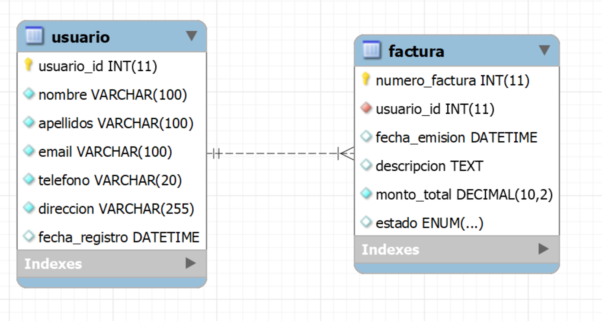
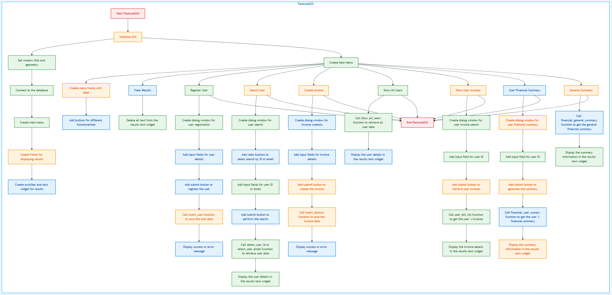
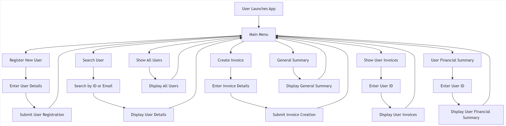

# 📚 Sistema de Gestión de Usuarios y Facturas

Sistema de gestión de usuarios y facturas con base de datos SQLite y una interfaz gráfica moderna.

## 📋 Estructura del Proyecto

```
ejercicio_evolve_bbdd/
├── database/                # Directorio para la gestión de la base de datos
│   ├── create_db.py         # Script para crear y configurar la base de datos SQLite
│   └── script.sql           # Script SQL con la definición de la estructura de la base de datos
├── docs/                    # Documentación del proyecto
│   ├── README.md            # Documentación principal del proyecto
│   └── estructura_bbdd.png  # Diagrama de la estructura de la base de datos
├── src/                     # Código fuente principal de la aplicación
│   ├── main.py              # Punto de entrada de la aplicación
│   ├── functions.py         # Implementación de las funciones de negocio
│   └── gui.py               # Implementación de la interfaz gráfica
└── .gitignore               # Archivo que especifica qué archivos/directorios ignorar en git
```



## 📋 Requisitos

- Python 3.8 o superior
- sqlite3 (incluido con Python por defecto)
- tkinter (incluido con Python por defecto)

## 🚀 Instalación y Ejecución

1. **Clonar el repositorio**
```bash
git clone https://github.com/DiegoPortillaC/ejercicio_bbdd.git
cd ejercicio_evolve_bbdd
```

2. **Crear la base de datos**
```bash
python database/create_db.py
```

3. **Ejecutar la aplicación**
```bash
python src/main.py
```

## 🛠️ Funcionalidades

- 📝 Registro de nuevos usuarios
- 🔍 Consulta de usuarios existentes por ID o email
- 💰 Creación de facturas
- 👥 Visualización de todos los usuarios
- 📊 Visualización de facturas por usuario
- 📈 Resumen financiero por usuario
- 📈 Resumen financiero general
- 🔄 Interfaz gráfica con tkinter


## 📝 Notas

- 🔐 Asegúrate de tener los permisos necesarios para crear archivos en el directorio donde clonas el repositorio.
- 💾 La base de datos SQLite se creará automáticamente en el directorio raíz del proyecto.
- 📱 La aplicación utiliza una interfaz gráfica intuitiva con botones y campos de entrada.
- 🔄 El sistema de validación asegura la integridad de los datos ingresados.
- 📝 Los resultados se muestran en un área de texto con formato tabular para mejor legibilidad.

## 📝 Flujo de codigo




## 📝 Flujo de usuario en la app

